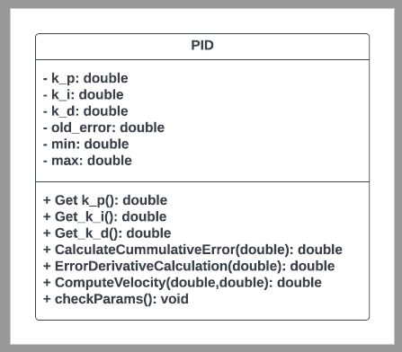

# PID_Controller
- A program that uses PID controller to control output velocity.
---
Part - 1:
- Driver : Koundinya Vinnakota
- Navigator : Mayank Sharma

Part - 2:
- Driver : Aneesh Chodisetty
- Navigator: Aniruddh Balram

## Dependencies
- C++ 
- CMake
- googletest
- lcov
- cpplint
- cppcheck
## Steps to run the project
```
cd <project_directory>
mkdir build
cd build
cmake ..
make
Run program: ./app/PID
```
## Steps to generate LCOV report
```
cd <project_directory>
mkdir build
cd build
cmake -D COVERAGE=ON -D CMAKE_BUILD_TYPE=Debug ../
make
make code_coverage
```
## Class Diagram 

